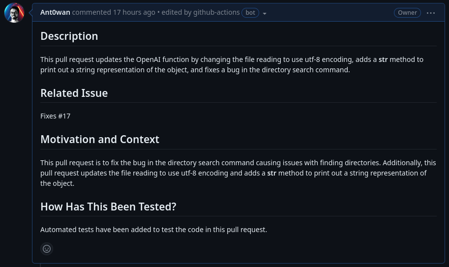

<br />
<p align="center">
  <a href="">
    
  </a>

  <h1 align="center">OpenAI PR</h1>

  <p align="center"><i>This GitHub Action generates a pull request description using OpenAI's GPT-3 API.</i>
  </p>
</p>

---

The **OpenAI PR Description Generator** is a GitHub Action that generates a pull request description using OpenAI. This action utilizes an OpenAI model to generate concise and context-aware pull request descriptions based on the provided information.


<p align="center">

<p align="center"><i>(An example of a pull request description generated by OpenAI PR)</i></p>
</p>


## Usage

To use the OpenAI PR Description Generator in your GitHub workflow, you can follow the example below:

```yaml
name: OpenAI PR Description Generator

on:
  pull_request:
    types:
      - opened
      - synchronize

permissions:
  pull-requests: write
  contents: read

jobs:
  pull-request:
    runs-on: ubuntu-latest
    steps:
      - uses: actions/checkout@v3
      - uses: Ant0wan/openai-pr@0.0.1-beta
        with:
          api-key: ${{ secrets.OPENAI_API_KEY }}
        env:
          GITHUB_TOKEN: ${{ secrets.GITHUB_TOKEN }}
```

## Inputs

The **OpenAI PR Description Generator** action provides the following inputs:

- `api-key` *(required)*: Your OpenAI API key. You can get one from the [OpenAI website](https://beta.openai.com/signup/).
- `model` *(optional)*: Specifies the OpenAI model to use. Default value is "text-davinci-003".
- `template` *(optional)*: PR content template for OpenAI to understand what should be included in the pull request description. Default value is an empty string.
- `template-filepath` *(optional)*: Path to the `PULL_REQUEST_TEMPLATE.md` file. Default value is `.github/PULL_REQUEST_TEMPLATE.md`.
- `header` *(optional)*: Intro phrase that provides context to the model. Default value is `"Based on the output of the command 'git diff', could you please generate a pull request description using the provided information? Be concise. Description must follow this format:\n"`.

```yaml
name: OpenAI PR Description Generator

on:
  pull_request:
    types:
      - opened
      - synchronize

permissions:
  pull-requests: write
  contents: read

jobs:
  pull-request:
    runs-on: ubuntu-latest
    steps:
      - uses: actions/checkout@v3
      - name: Generate PR Description
        uses: Ant0wan/openai-pr@0.0.1-beta
        with:
          api-key: ${{ secrets.OPENAI_API_KEY }}
          model: "text-davinci-002"
          template: |
            ## Description

            This pull request addresses the following issues:

            - Issue 1
            - Issue 2

            ## Changes

            - Change 1
            - Change 2
          header: "Hello, I need your help in generating a pull request description. Please analyze the changes and provide a concise description."
        env:
          GITHUB_TOKEN: ${{ secrets.GITHUB_TOKEN }}
```

Another way of using it specifying only template-filepath:

```yaml
name: OpenAI PR Description Generator

on:
  pull_request:
    types:
      - opened
      - synchronize

permissions:
  pull-requests: write
  contents: read

jobs:
  pull-request:
    runs-on: ubuntu-latest
    steps:
      - uses: actions/checkout@v3
      - name: Generate PR Description
        uses: Ant0wan/openai-pr@0.0.1-beta
        with:
          api-key: ${{ secrets.OPENAI_API_KEY }}
          template-filepath: ".github/PR_TEMPLATE.md"
        env:
          GITHUB_TOKEN: ${{ secrets.GITHUB_TOKEN }}
```

## How It Works

This action runs as a composite action with three steps:
1. **Install Python**: Installs Python version 3.11.
2. **Install Dependencies**: Installs the required dependencies listed in `requirements.txt`.
3. **Generate Description**: Runs `python main.py` to generate the pull request description using OpenAI's GPT-3 API and leveraging GitHub Api.

## Contributing

Contributions are welcome! If you have any suggestions, bug reports, or feature requests, please [create an issue](https://github.com/Ant0wan/openai-pr/issues) in the repository associated with this README.

## License

This project is licensed under the [GNU General Public License v3.0](LICENSE). You are free to modify and distribute the code as per the terms of the license. See the `LICENSE` file for more details.
